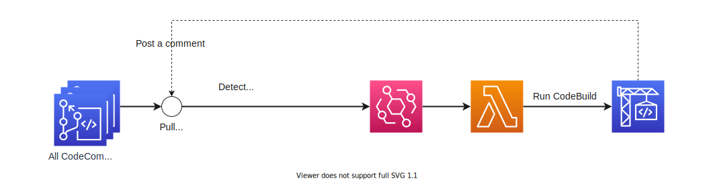

# Minimum example of CodeBuild triggered by pull requests.

## Architecture


## How does it work?
When you create a pull request or update the source branch, CodeBuild project for CI is triggered.

### Why Lambda?
Some of you may be wondering why we need Lambda, why we cannot trigger CodeBuild project directly from EventBridge.

The reason is that codebuild does not support dynamic path parameters, i.e., the ability to receive input from EventBridge and change the startup parameters.

In this project, we use a single CodeBuild project and override parameters like `repository name` or `source branch` at startup. To achieve this, we are using Lambda.

## Project structure
```
terraform
├── env
│   └── example
│       ├── main.tf
│       └── providers.tf
└── module
    └── codebuild_triggered_by_pull_request
        ├── buildspec.yml
        ├── codebuild.tf
        ├── codecommit_dummy.tf
        ├── event.tf
        ├── iam_codebuild.tf
        ├── iam_event.tf
        ├── iam_lambda.tf
        ├── lambda.tf
        ├── src
        │   └── handler.py
        └── upload
            └── lambda.zip
```
